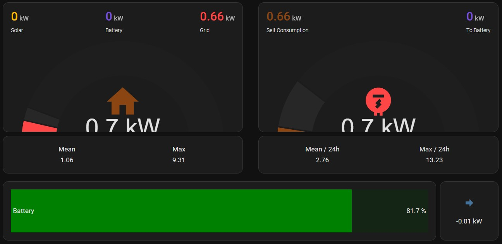

# Energy flow gauge displaying energy consumption and generation.

This is a set of gauges displaying energy flow from grid, solar and battery.

# Pre-requirements

This has not been tested on HA earlier than 2024.9 and requires the following HACS addons:

- Apex-Charts card
- Config Template Card Card - For scripting inside the chart card.
- lovelace-card-mod - For styling.
- bar-card

The sensor names needs to be changed to suit your system.

# Installation
- Copy - paste the raw card code from `energy_flow.yaml` to your a new card on you lovelace dashboard. Add any card and replace the raw code that you can edit by clicking on the *SHOW CODE EDITOR* in the bottom left.

# Configuration 

In the chart-card you should change the following variables to suit your needs:

  - Check so the sensor names are correct.
