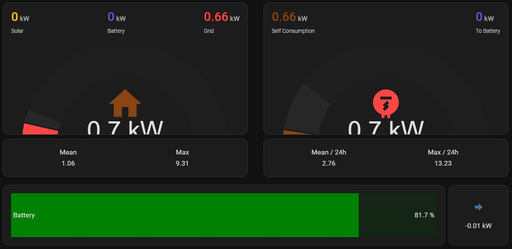

# Energy flow gauge displaying energy consumption and generation.

This is a set of gauges displaying energy flow from grid, solar and battery.

# Pre-requirements

This has not been tested on HA earlier than 2024.9 and requires the following HACS addons:

- [Apex-Charts card](https://github.com/RomRider/apexcharts-card)
- [Config Template Card](https://github.com/custom-cards/config-template-card)
- [lovelace-card-mod](https://github.com/thomasloven/lovelace-card-mod)
- [Button Card](https://github.com/custom-cards/button-card)

The sensor names needs to be changed to suit your system.

# Installation
- Copy - paste the raw card code from `energy_flow.yaml` to your a new card on you lovelace dashboard. Add any card and replace the raw code that you can edit by clicking on the *SHOW CODE EDITOR* in the bottom left.

- Copy - paste the raw code in `power_flow_gauges_sigen.yaml` to your HA configuration.yaml file or a new file in the config/packages folder of your HA installation. If you create a new file in the config/packages folder for the first time, you need to add `package: !include_dir_named packages` to your configuration.yaml file.

# Configuration 

In the chart-card you should change the following variables to suit your needs:

  - Check so the sensor names are correct.
